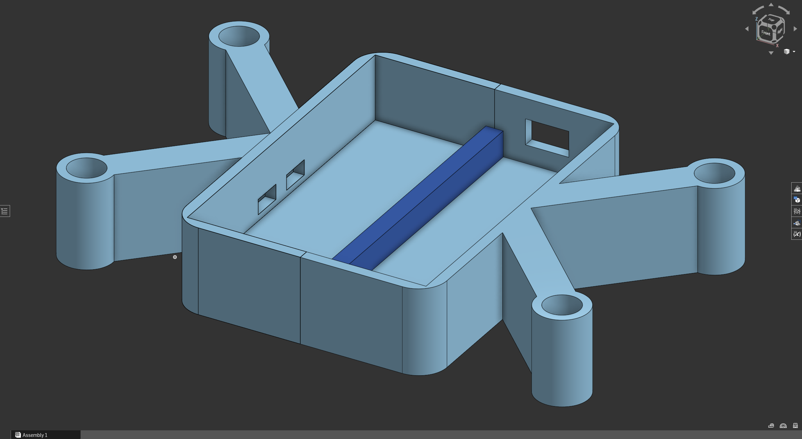
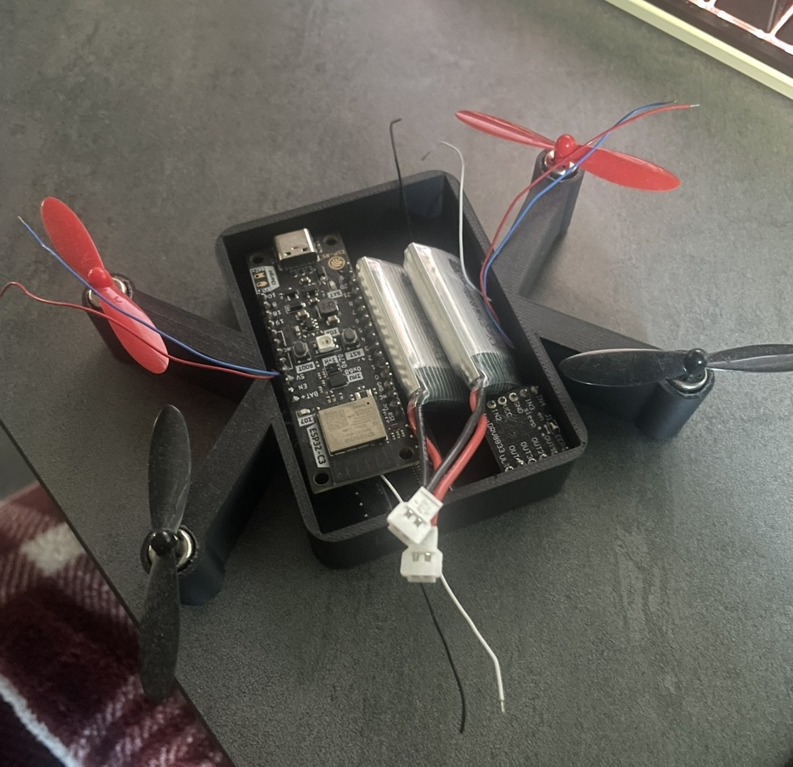
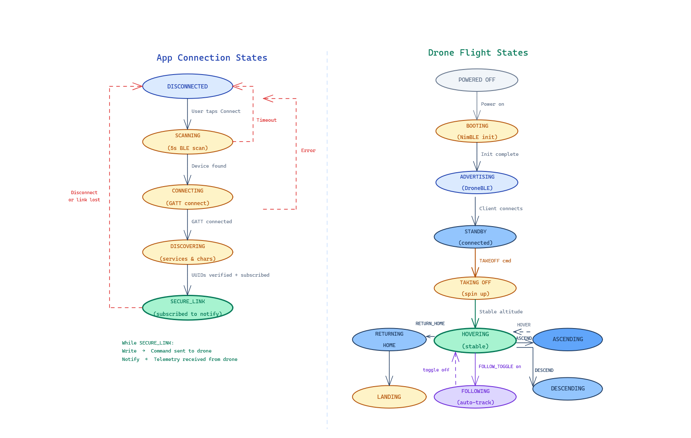

### Design

**Aesthetic Prototype**

**Design for Manufacture, Assembly, Maintenance**
The drone frame is designed with manufacturability and assembly in mind. The structure uses a lightweight 3D-printed frame that can be produced quickly using common additive manufacturing equipment. The design separates the frame into simple components so that damaged parts, such as propeller arms or mounts, can be replaced individually without rebuilding the entire structure. Standard fasteners and mounting holes are used to attach motors, electronics, and the battery to ensure compatibility with commonly available hardware.

Assembly focuses on a modular approach where each subsystem—power, flight control, propulsion, and camera—can be installed independently. This modularity simplifies both initial construction and troubleshooting during development. Wiring is routed through the frame to reduce interference with the propellers and to keep the system organized and accessible.

Maintenance was also considered during the design process. Key components such as the battery, propellers, and microcontroller are easily accessible so they can be replaced or serviced when needed. Because drones experience mechanical stress during flight, the design allows quick replacement of high-wear parts, helping extend the lifespan of the system and reduce downtime during testing or future operation.

**Block Diagrams**

**Wiring Diagrams**

**State Transition Diagrams**

**Technology**

The prototype system is built using a custom PCB as the central computing platform. The custom PCB was selected because it integrates wireless communication capabilities, sufficient processing performance, and flexible GPIO interfaces for controlling external hardware. Its built-in Bluetooth functionality enables direct communication with the mobile application without requiring additional wireless modules.

The propulsion system consists of four motors with propellers arranged in a quadcopter configuration. Each motor can be controlled independently, allowing the system to generate lift and directional movement through differential thrust. The drone is powered by a rechargeable lithium-polymer battery that provides a lightweight energy source suitable for aerial applications.

A mobile application serves as the primary user interface. The app manages Bluetooth connections, provides directional controls, and displays system status. This approach leverages the user's existing smartphone hardware, reducing the need for additional controllers and simplifying the user experience.

**Simulations**

At this stage of development, the focus has been on validating communication and hardware integration through physical prototyping rather than extensive simulation. Initial testing was performed directly on the hardware to verify Bluetooth connectivity and motor activation through the mobile application.

Future development may incorporate simulation tools to model flight dynamics and control algorithms before implementing them on the physical drone. Simulations could allow the team to test autonomous behaviors, sensor integration, and control stability in a controlled virtual environment before deploying those features on the hardware platform. This approach would reduce development risk and improve system reliability as more advanced functionality is added.
