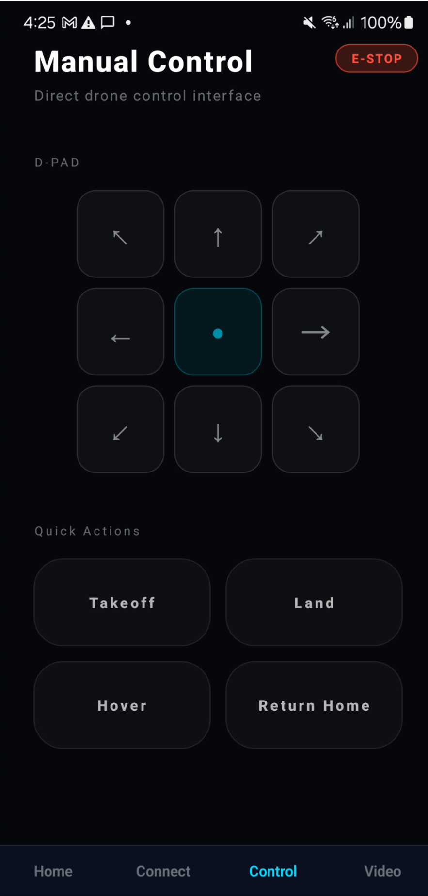
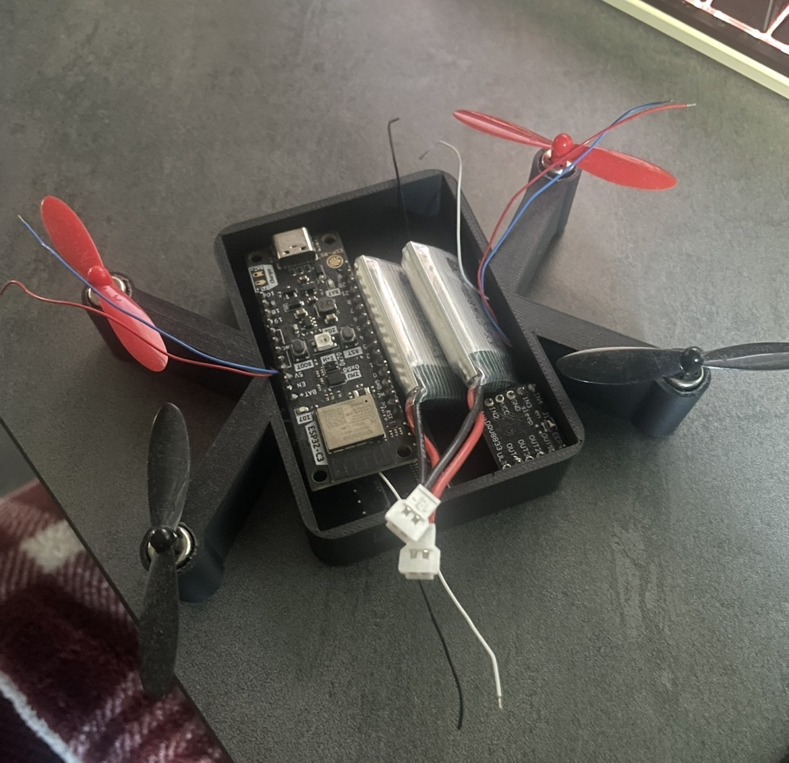

### Evaluation

Our current prototype demonstrates that the core communication and motor control functions for the autonomous drone are functional. The mobile application successfully connects to the custom PCB controller via Bluetooth and enables the selective activation of individual propellers. These results, validated through structured testing, confirm that the basic design architecture is practical and provides a reliable foundation for future development.

**Functional Prototype**

The functional prototype consists of a custom PCB-based flight controller mounted on a quadcopter 3D-printed frame with four brushless motors and propellers powered by a LiPo battery system. The custom PCB serves as the central microcontroller, providing integrated Bluetooth connectivity and sufficient processing capability for current control functions and future autonomy features. Each motor is connected directly to a dedicated PWM-capable GPIO pin on the custom PCB, with shared ground connections and separate power rails for logic and motor operation.

The custom PCB firmware initializes Bluetooth advertising and accepts connections from mobile devices, as verified in our firmware test plan. The mobile application scans for the custom PCB, establishes a Bluetooth connection, and provides controls for individual motors. Our testing successfully demonstrated stable Bluetooth connectivity, including device discovery and reliable reconnection across multiple connect/disconnect cycles.

Photographs of the prototype:

**App Screenshots**

### Connect Screen

### Home Screen

### Manual Control

### Live Video Feed

## Prototype Photos

**Testing**

The manufacturing test plan in Appendix 3 defines how a fully assembled production drone will be evaluated before it is authorized to leave from manufacturing. Six tests (MECH-01 through FLT-01) cover visual mechanical inspection, safe power‑on and idle current behavior, PCB and sensor self‑tests, verification of the control link and command protocol, tethered motor mapping and spin‑up checks, and a sample hover/failsafe flight test. Together, these tests are designed to catch structural, electrical, and control issues early. They are also designed to demonstrate that every manufactured unit can power on safely, communicate correctly, spin the correct motors in the correct directions, and maintain a stable hover while following the documented failsafe policy.
