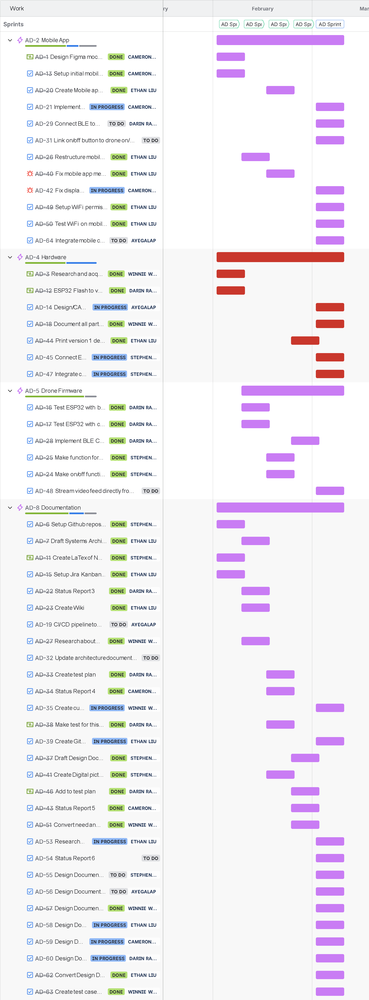

### Appendix 2 – Planning

#### Basic Plan / Gantt Chart

#### Division of Labor During Prototyping Phase

The table below summarizes each team member's primary areas of contribution during the prototyping phase. Work was tracked and assigned through Jira across five sprints.

| Team Member                | Primary Contributions                                                                                                                                                                                                                                                               |
| -------------------------- | ----------------------------------------------------------------------------------------------------------------------------------------------------------------------------------------------------------------------------------------------------------------------------------- |
| **Ethan Liu**              | Worked on mobile app development, including fixing BLE implementation bugs, restructuring the project for expo-router, implementing manual controls, and setting up WiFi permissions and testing. Set up the Jira Kanban board and led the weekly scrums.                           |
| **Cameron Dubois**         | Designed the initial Figma mockups for the mobile app and set up the mobile project environment. Implemented Bluetooth connectivity on the mobile side and fixed display issues.                                                                                                    |
| **Darin Rahm**             | Focused on drone firmware, including testing ESP32 Bluetooth and WiFi connectivity and implementing BLE commands for motor control. Also authored the test plan and created demonstration tests.                                                                                    |
| **Stephen Wend-Bell**      | Worked across firmware and hardware — wrote the motor on/off and speed control functions, and integrated the ESP32 with new hardware components and the camera module. Set up the GitHub repository, created the initial LaTeX documents, and produced the digital system diagrams. |
| **Winnie Wong**            | Handled parts research and acquisition, documented component sizes for the final design, and researched campus drone flight guidelines. Designed a custom PCB schematic and created test cases.                                                                                     |
| **Abhiram Sai Yegalapati** | Designed the updated CAD model for the drone shell and worked on wiring. Continously improving on drone CAD model and releasing new iterations with every change.                                                                                                                   |

---

#### Collaboration

We used the following tools and processes to coordinate work:

- **Jira** – We used Jira with Kanban boards and Scrum to manage sprints, bugs, and tasks. Epics and stories were broken down into sprint-sized work, and we tracked progress through columns (e.g., To Do, In Progress, In Review, Done). Sprint planning were held regularly at our first meeting of the week.
- **GitHub** – The repository was used for all code, documentation, and design files.
- **Discord** – Discord served as the main channel for day-to-day messaging, quick questions, meeting coordination, and sharing updates between synchronous meetings.
