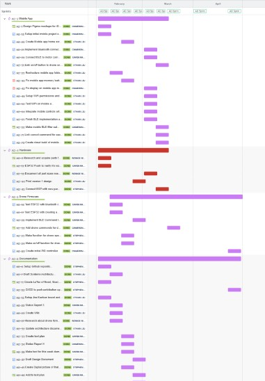
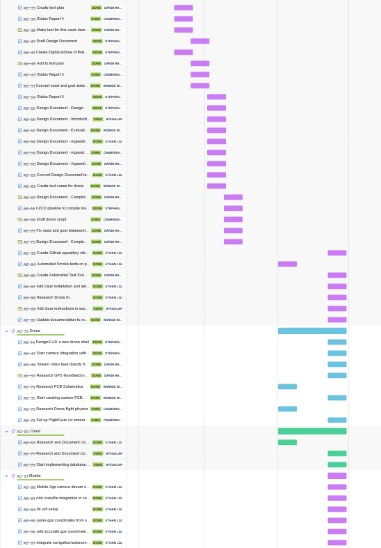

### Appendix 2 – Planning

#### Basic Plan / Gantt Chart

Roadmap exported from Jira (Feb–Apr 2026). Epics cover mobile app, hardware procurement, drone firmware, documentation, and Q2 integration work (GPS, navigation, camera stream). The roadmap is shown in two halves below so the task labels remain legible at print size.

#### Division of Labor During Prototyping Phase

The table below summarizes each team member's primary areas of contribution from prototyping through the current quarter (Feb–Jun 2026). Work was tracked in Jira; deliverables are reflected in the GitHub monorepo.

| Team Member                | Primary Contributions                                                                                                                                                                                                       |
| -------------------------- | -------------------------------------------------------------------------------------------------------------------------------------------------------------------------------------------------------------------------- |
| **Ethan Liu**              | Continued mobile app development, including expo-router restructure, BLE fixes, manual controls, and WiFi/hybrid testing. Set up the Jira board, led weekly scrums, and contributed design-document appendix and evaluation updates. |
| **Cameron Dubois**         | Bootstrapped the mobile app (BLE, Connect UI) and hybrid comms layer. Contributed flight-control bench work, follow-to-phone navigation, and barometer integration across app and firmware.                                  |
| **Darin Rahm**             | Focused on drone firmware, including ESP32 BLE and WiFi connectivity, GATT command protocol, and soft-AP/TLS integration. Authored the test plan and demonstration tests.                                                    |
| **Stephen Wend-Bell**      | Set up the GitHub repository and documentation pipeline; motor control functions and system diagrams. Integrated GPS/compass bring-up and authored technical design chapters on comms, telemetry, and mobile architecture.   |
| **Winnie Wong**            | Handled parts research and acquisition, PCB schematic, and campus drone flight guidelines. Authored camera-integration design content and component documentation.                                                          |
| **Abhiram Sai Yegalapati** | Designed and iterated the drone shell CAD model and wiring layout. Released new frame revisions as board and sensor layout changed.                                                                                          |

---

#### Collaboration

We used the following tools and processes to coordinate work:

- **Jira** – We used Jira with Kanban boards and Scrum to manage sprints, bugs, and tasks. Epics and stories were broken down into sprint-sized work, and we tracked progress through columns (e.g., To Do, In Progress, In Review, Done). Sprint planning was held regularly at our first meeting of the week.
- **GitHub** – The repository was used for all code, documentation, and design files.
- **Discord** – Discord served as the main channel for day-to-day messaging, quick questions, meeting coordination, and sharing updates between synchronous meetings.
